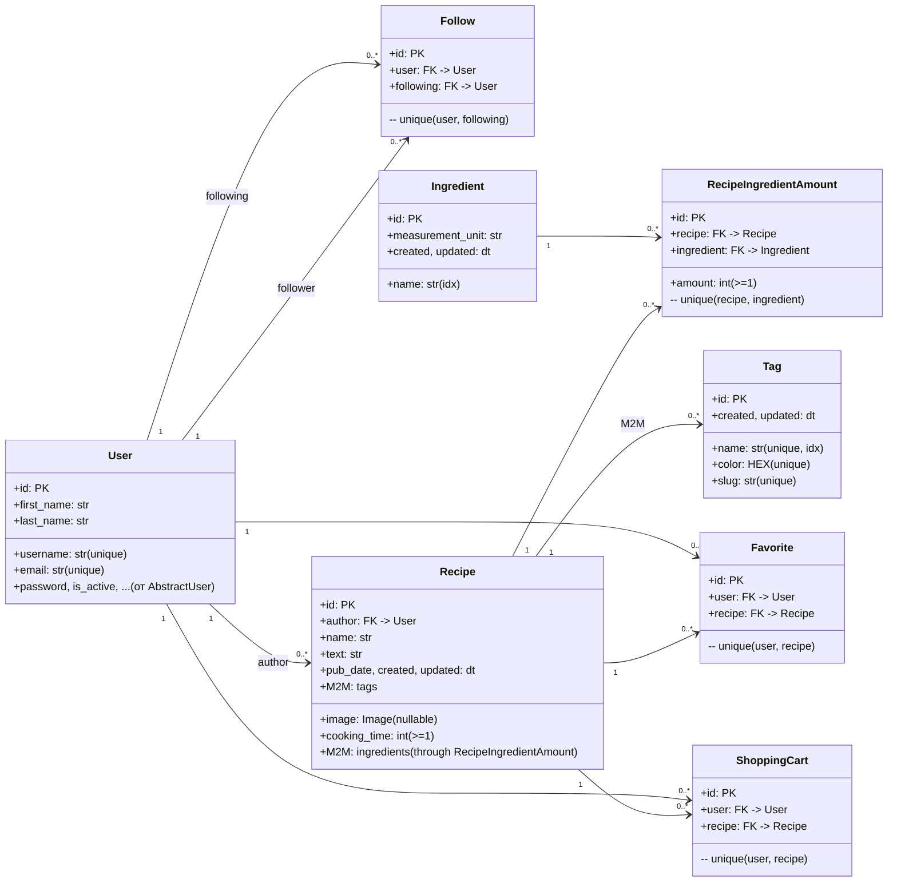

# Domain Model — Foodgram

## 0 Источник

* Бэкенд: Django ORM (`users.models`, `recipes.models`)
* Этот документ описывает доменные сущности, связи, ограничения и вычисляемые поля, чтобы синхронизировать код, БД и API

---

## 1 Карта сущностей

---

## 2 Сущности и поля

### 2.1 User

Источник: `users.models.User` (наследник `AbstractUser`)

* `id: PK`
* `username: Char(<=200), unique, UnicodeUsernameValidator`
* `email: Email(<=200), unique`
* `first_name: Char(<=200), required`
* `last_name: Char(<=200), required`
* Наследуемые поля Django (`password`, `is_active`, и т.д.)
* Индексация/сортировка: `ordering = (first_name, last_name)`

**API-виды:**

* `User` (публичный профиль)
* `UserWithRecipes` (профиль + рецепты)
* Вычисляемое поле: `is_subscribed: bool` — подписан ли *текущий* пользователь на данного

---

### 2.2 Follow (подписки)

* `user: FK(User)`, `following: FK(User)`
* Ограничение: `UniqueConstraint(fields=['user','following'])`
* Правило: пользователь не может подписаться на себя (валидируется в сервисе/серриалайзере)
* Каскады: `on_delete=CASCADE`

---

### 2.3 Ingredient

* `name: Char(<=200), db_index=True`
* `measurement_unit: Char(<=200)`
* `created: auto_now_add`, `updated: auto_now`
* `ordering = ('name',)`
* Используется через join-таблицу `RecipeIngredientAmount`

**API-вид:**

* `Ingredient`
* Поиск: `name` (префиксный)

---

### 2.4 Tag

* `name: Char(<=200), unique, db_index=True`
* `color: ColorField(hex, max_length=7), unique, default=#49B64E`
* `slug: Slug, unique`
* `created/updated: dt`
* `ordering = ('name',)`

**API-вид:**

* `Tag`

---

### 2.5 Recipe

* `author: FK(User, related_name='recipes', CASCADE)`
* `name: Char(<=200)`
* `image: ImageField(upload_to='recipes/image/', null=True, default=None)`
  (в API `RecipeCreateUpdate.image` — data URL (Base64), на стороне сервера сохраняется файл и в `RecipeList.image` отдается абсолютный URL)
* `text: Text(<=500)`
* `ingredients: M2M(Ingredient) through RecipeIngredientAmount`
* `tags: M2M(Tag, related_name='recipes')`
* `cooking_time: PositiveSmallInteger (MinValue=1)`
* `pub_date: auto_now_add, indexed`
* `created/updated: dt`
* `ordering = ('-pub_date','name')`

**API-вид:**

* `RecipeList` (для списка/деталей)
* `RecipeMinified` (для избранного/корзины)

**Вычисляемые поля в API:**

* `is_favorited: bool` — есть ли запись в `Favorite` у текущего пользователя
* `is_in_shopping_cart: bool` — есть ли запись в `ShoppingCart` у текущего пользователя

---

### 2.6 RecipeIngredientAmount (join-таблица)

* `recipe: FK(Recipe, related_name='ingredienttorecipe', CASCADE)`
* `ingredient: FK(Ingredient, related_name='ingredients', CASCADE)`
* `amount: PositiveSmallInteger (MinValue=1)`
* Ограничение: `unique (recipe, ingredient)`
* Назначение: хранит количество каждого ингредиента в рецепте

**API-вид:**

* В `RecipeList.ingredients` как объекты с полями `{id, name, measurement_unit, amount}`

---

### 2.7 Favorite (избранное)

* Абстрактный предок: `FavoriteShoppingList` (дает уникальность `user+recipe`)
* Конкретная модель: `Favorite`
* Ограничение: `unique (user, recipe)`
* Связи: `user: FK(User)`, `recipe: FK(Recipe)`, `on_delete=CASCADE`

**API:**

* `POST /recipes/{id}/favorite/` → 201 + `RecipeMinified`
* `DELETE /recipes/{id}/favorite/` → 204

---

### 2.8 ShoppingCart (список покупок)

* Наследуется от `FavoriteShoppingList`
* Ограничение: `unique (user, recipe)`
* Связи: `user: FK(User)`, `recipe: FK(Recipe)`, `on_delete=CASCADE`

**API:**

* `POST /recipes/{id}/shopping_cart/` → 201 + `RecipeMinified`
* `DELETE /recipes/{id}/shopping_cart/` → 204
* `GET /recipes/download_shopping_cart/` → бинарный файл (PDF/TXT)

---

## 3 Вычисляемые/производные поля (в API)

| Поле                         | Где видно                 | Как считается                                                         |
| ---------------------------- | ------------------------- | --------------------------------------------------------------------- |
| `User.is_subscribed`         | `User`, `UserWithRecipes` | `exists(Follow where user=current_user AND following=this_user)`      |
| `Recipe.is_favorited`        | `RecipeList`              | `exists(Favorite where user=current_user AND recipe=this_recipe)`     |
| `Recipe.is_in_shopping_cart` | `RecipeList`              | `exists(ShoppingCart where user=current_user AND recipe=this_recipe)` |

> Эти поля **зависят от текущего пользователя** (требуют аутентификации). Для анонимного всегда `false`.

---

## 4 Инварианты и бизнес-правила

* User:

  * `username` и `email` — **уникальные**.
* Follow:

  * уникальность пары `(user, following)`;
  * **запрещена** подписка на самого себя (валидируется на уровне приложения).
* RecipeIngredientAmount:

  * уникальность пары `(recipe, ingredient)`;
  * `amount >= 1`.
* Recipe:

  * `cooking_time >= 1`;
  * `text` ограничен 500 символами (см. модель).
* Favorite / ShoppingCart:

  * уникальность `(user, recipe)` — нельзя добавить дубликат.
* Удаление:

  * `on_delete=CASCADE` для всех FK — удаление `User`/`Recipe` тянет связанные данные.

---

## 5 Хранение медиа

* `Recipe.image` — `ImageField` → файловое хранилище (локальный диск/S3/иное).
* API-поток:

  * Ввод: `RecipeCreateUpdate.image` как data URL (Base64).
  * Сервер декодирует и сохраняет файл в `upload_to='recipes/image/'`.
  * Вывод: `RecipeList.image` — **абсолютный URL** до картинки.

---

## 6 Индексы и производительность

* Индексированы:

  * `Ingredient.name` (поиск по префиксу),
  * `Tag.name` (через `db_index`), `Tag.slug`, `Tag.color` — уникальные,
  * `Recipe.pub_date` — индекс по дате публикации.
* Рекомендуемые составные индексы (если нагрузка растёт):

  * `Favorite(user, recipe)` и `ShoppingCart(user, recipe)` (для быстрых exists-проверок),
  * `Follow(user, following)`,
  * `RecipeIngredientAmount(recipe, ingredient)`.

---

## 7 Соответствие API ↔ Domain

* `RecipeList.author` — это `User`.
* `RecipeList.ingredients` — собранный джоин `RecipeIngredientAmount` + `Ingredient`.
* `RecipeCreateUpdate.ingredients` — список `{id, amount}` → записывается в `RecipeIngredientAmount`.
* `RecipeList.tags` — M2M `Recipe` ↔ `Tag`.
* `UserWithRecipes.recipes` — короткие объекты `RecipeMinified`.

---

## 8 Жизненный цикл ключевых объектов

**Recipe**

1. Создание: автор → POST `/recipes/` с `{name, text, image(base64), tags[], ingredients[], cooking_time}`.
2. Обновление: PATCH `/recipes/{id}/` (только автор).
3. Удаление: DELETE `/recipes/{id}/` (только автор). Каскадно удаляются Favorite/ShoppingCart/ссылки из join-таблицы.

**Подписки/Избранное/Корзина**

* Обеспечивается уникальными ограничениями.
* Ошибки 400 при попытке повторно добавить существующую связь/удалить отсутствующую.

---

## 9 Нефункциональные заметки

* Экспорт списка покупок должен агрегировать `RecipeIngredientAmount` для всех рецептов пользователя в корзине (группировка по ингредиенту + суммирование `amount`).

---

## 10 Словарь терминов

* **Избранное (Favorite):** персональный список пометок «нравится» для рецептов.
* **Список покупок (ShoppingCart):** список рецептов для дальнейшего экспорта ингредиентов.
* **Подписки (Follow):** «я подписан на автора N», чтобы видеть его рецепты.
* **Ингредиент в рецепте (RecipeIngredientAmount):** связь рецепт↔ингредиент с количеством.

---

## 11 Политика изменений (Domain)

* **Ломающие:**

  * переименование/удаление полей, изменение типов, снятие уникальных ограничений,
  * смена семантики вычисляемых полей,
  * изменение каскадов удаления.
* **Неломающие:**

  * добавление необязательных полей, индексов,
  * введение новых связей, не влияющих на существующие API-ответы.

Все отклонения фиксируются в `contract_deltas.md` с датой, описанием и обоснованием.
